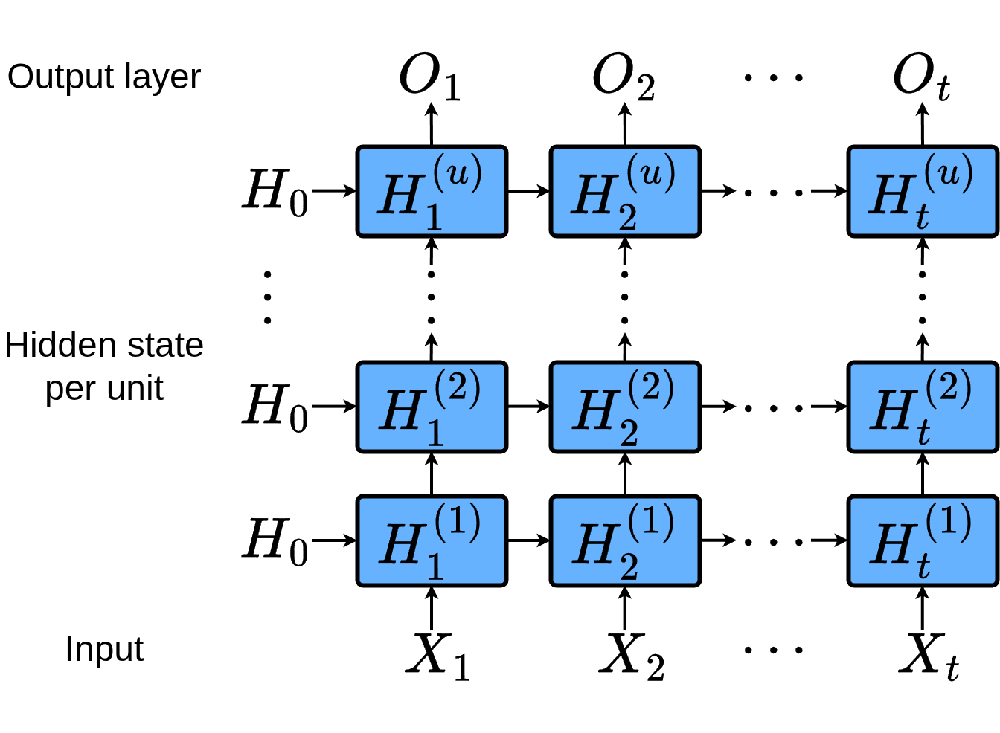
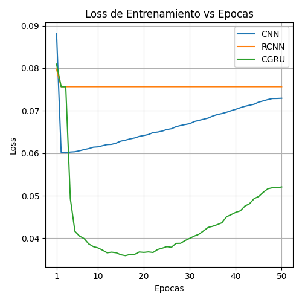
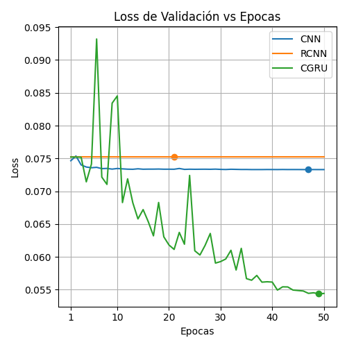
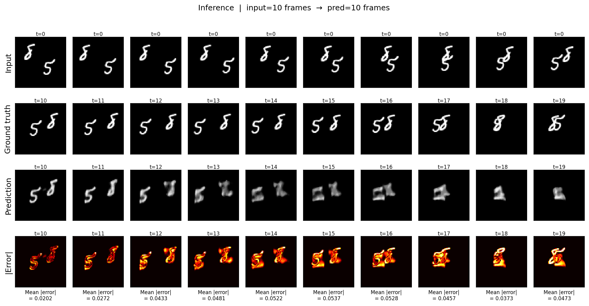
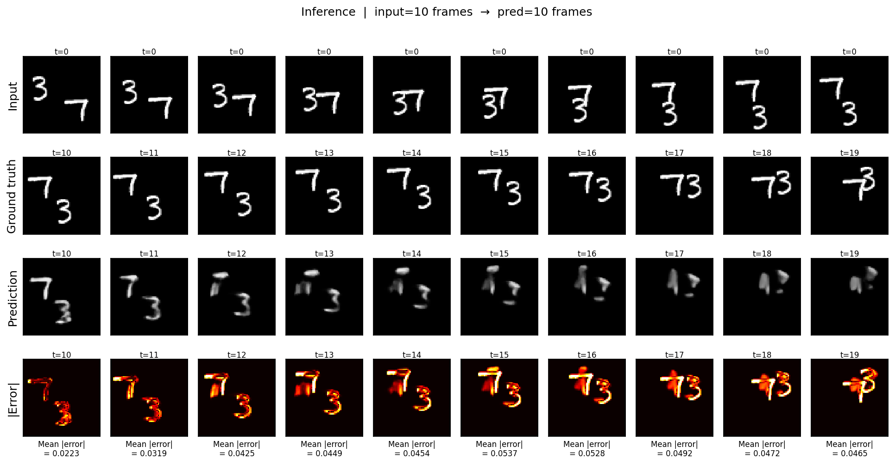
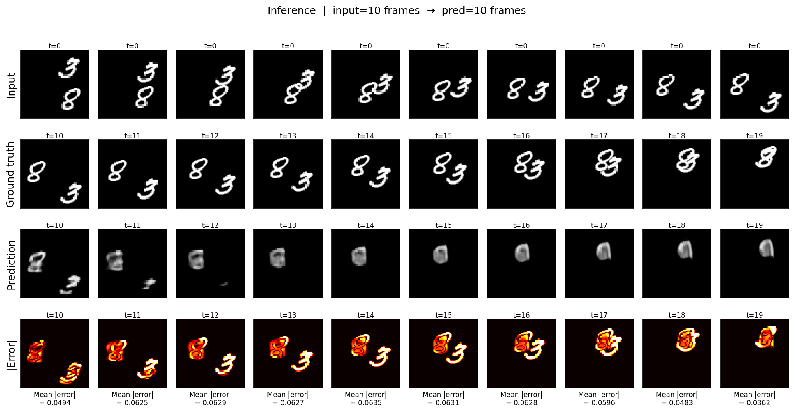

# Recurrent Convolution Neural Network — Video Prediction

A university project comparing three neural network architectures for the task of **video frame prediction**, using the Moving MNIST dataset. The central idea is to measure how much the recurrent component contributes compared to a CNN with no temporal memory.

The three implemented models are:

- **RCNN2d** — An RNN where scalar weights are replaced by `Conv2d` kernels, both in the input→hidden and hidden→hidden transitions.
- **Conv2dGRU (CGRU)** — A full GRU (update gate, reset gate, candidate) implemented with convolutional operations.
- **CNN** — A recurrence-free baseline. Each frame is processed independently, with no hidden state carried between timesteps.

> [!TIP]
> You can run a demo in Google colab [](
https://colab.research.google.com/github/PilotLeoYan/Recurrent-Convolution-NN//blob/main/RCNN_Colab_Demo.ipynb
)

---

## Table of Contents

- [Project Structure](#project-structure)
- [Architecture](#architecture)
- [Dataset](#dataset)
- [Training](#training)
- [Installation](#installation)
- [Usage](#usage)
- [Configuration](#configuration)
- [Pretrained Weights](#pretrained-weights)
- [Results](#results)

---

## Project Structure

```
Recurrent-Convolution-NN/
├── config.json
├── requirements.txt
├── main/
│   ├── __main__.py
│   ├── models/
│   │   ├── rcnn.py          # RCNN2d
│   │   ├── cgru.py          # Conv2dGRU
│   │   └── cnn.py           # CNN baseline
│   ├── train/
│   │   └── train.py
│   ├── evaluate/
│   │   ├── evaluate.py
│   │   └── metrics.py       # MAE and MSE
│   ├── losses/
│   │   └── __init__.py      # CombinedLoss (MSE + SSIM)
│   ├── optimizers/
│   │   └── __init__.py
│   ├── data/
│   │   ├── downloader.py    # Dataset download and split
│   │   ├── dataset.py
│   │   ├── dataloader.py
│   │   └── transform.py
│   ├── visualize/
│   │   └── visualize.py
│   └── utils/
│       ├── args.py
│       ├── json_loader.py
│       ├── logger.py
│       └── csv_logger.py
└── saves/
    ├── weights/
    ├── training_logs/
    └── visualizations/
```

---

## Architecture

All three models share the same encode-decode interface:

- `forward(x, h0)` — receives a sequence `(seq_len, batch, C, H, W)` and returns per-timestep predictions along with the final hidden state.
- `decode(pred_len, last_frame, h, ...)` — autoregressively generates `pred_len` future frames using the encoder's hidden state.
- `output_proj` — a `Conv2d 1×1 + Sigmoid` layer that maps the feature map back to pixel space `[0, 1]`.



**RCNN2d** stacks `units` recurrent layers. Each layer has two separate `Conv2d` modules: one for the input (`conv2d_ih`) and one for the hidden state (`conv2d_hh`), following the formula `h_t = act(W_ih·x_t + W_hh·h_{t-1})` but in 2D convolutional space. Kaiming normal initialization is used for the input convolutions and orthogonal initialization for the recurrent ones.

**Conv2dGRU** replaces each scalar weight in a standard GRU cell with a `Conv2d` kernel. Each cell computes update gate `z`, reset gate `r`, and candidate `n` via convolutional projections, capturing spatial and temporal patterns simultaneously.

**CNN** is a stack of `Conv2d + ReLU` layers with no state. It serves as a lower bound: if the recurrent models do not outperform it, the temporal component is not contributing anything useful.

All recurrent models use `Dropout(p=0.2)` between hidden layers (except the last one) to regularize the recurrent path.

---

## Dataset

**Moving MNIST** — sequences of 20 grayscale frames, with two digits moving inside a 64×64 frame.

- Original source: `https://www.cs.toronto.edu/~nitish/unsupervised_video/mnist_test_seq.npy`
- The downloader (`data/downloader.py`) fetches it automatically on first use (with retries and a progress bar) and generates the split inside the `dataset/` folder:

| Split | Proportion | File |
|---|---|---|
| Train | 70% | `moving_mnist_train.npy` |
| Validation | 15% | `moving_mnist_valid.npy` |
| Test | 15% | `moving_mnist_test.npy` |

The split uses a fixed seed (`seed=42`). Each sample is a tensor `(seq_len, 1, 64, 64)` normalized to `[0, 1]`. The sequence is divided at `split_seq_len` (default `10`): the first 10 frames are the **input** and the remaining ones are the **target** to predict.

> **Pre-split dataset available:** see [Pretrained Weights](#pretrained-weights).

---

## Training

### Loss

A **combined MSE + SSIM loss** is used:

```
L = α · MSE(pred, target) + (1 − α) · (1 − SSIM(pred, target))
```

with `α = 0.85`. SSIM is approximated using average pooling with an 11×11 window. The combination aims for predictions that are accurate at the pixel level (MSE) and visually sharp (SSIM).

### Optimizer and Scheduler

- AdamW (`lr = 0.001`, `weight_decay = 0.01`)
- Cosine annealing with linear warm-up (3 warm-up epochs, `T_max = 50`, `eta_min = 1e-6`)
- Gradient clipping with `max_norm = 5.0`

### Teacher Forcing

During decoding, the probability of using the ground-truth frame instead of the model's own prediction decays linearly with epochs:

```
tf_ratio = max(0.05, 1.0 − epoch / (epochs − 1))
```

It starts at 1.0 (always uses ground truth) and ends at 0.05 (almost fully autoregressive).

### Hardware

| Component | Specification |
|---|---|
| GPU | NVIDIA GeForce RTX 2070 Super (8 GB VRAM) |
| RAM | 16 GB DDR4 |
| CPU | AMD Ryzen 7 — 8 cores / 16 threads |

### Training Times

All three models were trained sequentially with the exact configuration from `config.json` (`epochs=50`, `hidden_channels=64`, `kernel_size=3`, `units=3`, `batch_size=8`).

| Model | Duration |
| --- | --- |
| RCNN2d | **1 h 37 m 39 s** |
| Conv2dGRU | **5 h 19 m 31 s** |
| CNN | **0 h 23 m 39 s** |
| **Total** | **≈ 7 h 20 m 49 s** |

The large gap between CGRU and the other models is expected: a GRU cell requires 6 `Conv2d` operations per layer per timestep (vs. 2 for RCNN2d), making it considerably more expensive.

Per-epoch metrics are automatically saved to `saves/training_logs/` as CSV files.

### Loss Curves

<table>
<tr>
<td></td>
<td></td>
</tr>
<tr>
<td align="center">Training loss</td>
<td align="center">Validation loss</td>
</tr>
</table>

CGRU reaches the lowest loss on both curves (~0.035 on train, ~0.055 on validation), although training is considerably more unstable, especially in the early epochs. The marked point on the validation curve indicates the saved checkpoint (best epoch). CNN and RCNN hover around 0.075, suggesting that without the GRU gates the model struggles to capture the temporal dynamics of the dataset.

---

## Installation

Requires Python ≥ 3.10 and a CUDA-capable GPU (recommended).

```bash
git clone https://github.com/<username>/Recurrent-Convolution-NN.git
cd Recurrent-Convolution-NN
pip install -r requirements.txt
```

Dependencies:

```
torch==2.11.0
torchvision==0.26.0
numpy==2.4.4
matplotlib==3.10.9
requests==2.33.1
tqdm==4.67.1
rich==15.0.0
setuptools==81.0.0
```

---

## Usage

All commands are run as a Python module from the project root:

```bash
# Train all models
python -m main --fit all

# Train a specific model
python -m main --fit rcnn
python -m main --fit cgru
python -m main --fit cnn

# Evaluate on the test set (uses the "eval" section of config.json)
python -m main --test

# Generate inference visualizations (uses the "visualize" section of config.json)
python -m main --visualize

# Use a different config file
python -m main --fit all --config path/to/config.json

# Help
python -m main --help
```

> On first use, the dataset is downloaded automatically (~780 MB) and split into `dataset/`. Subsequent runs detect the existing files and skip the download.

Logs are written to `logs/rcnn.log` (automatic rotation, max 5 MB, 3 backups) and also printed to the console.

---

## Configuration

All experiment control is in `config.json`, with three main sections:

### `fit` — training

```jsonc
{
  "fit": {
    "hidden_channels": 64,      // feature maps in hidden layers
    "kernel_size": 3,            // conv kernel size (same padding)
    "units": 3,                  // stacked recurrent/conv layers
    "activation": "relu",        // "relu" or "tanh" (RCNN2d only)
    "device": "cuda",
    "lr": 0.001,
    "weight_decay": 0.01,
    "split_seq_len": 10,         // input frames; the rest are targets
    "epochs": 50,
    "save_best": true,
    "model_path": "saves/weights",
    "csv_log": { "output_dir": "saves/training_logs" },
    "train":  { "batch_size": 8, "data_augmentation": false, "n_workers": 4 },
    "valid":  { "batch_size": 32, "n_workers": 0 },
    "test":   { "batch_size": 32, "n_workers": 0 },
    "lr_scheduler": {
      "type": "cosine_warmup",
      "T_max": 50,
      "eta_min": 0.000001,
      "warmup_epochs": 3
    }
  }
}
```

### `eval` — evaluation

```jsonc
{
  "eval": {
    "model_type": "cnn",                         // "rcnn2d", "cgru", or "cnn"
    "model_path": "saves/weights_cnn_best.pth",
    "batch_size": 32,
    "n_workers": 0,
    "split_seq_len": 10,
    "device": "cuda",
    "hidden_channels": 64,
    "kernel_size": 3,
    "units": 3,
    "activation": "relu"
  }
}
```

### `visualize` — visual inference

```jsonc
{
  "visualize": {
    "model_type": "cgru",
    "model_path": "saves/weights_cgru_best.pth",
    "batch_size": 32,
    "n_workers": 0,
    "split_seq_len": 10,
    "device": "cuda",
    "hidden_channels": 64,
    "kernel_size": 3,
    "units": 3,
    "activation": "relu",
    "n_samples": 5,
    "output_dir": "saves/visualizations",
    "colormap": "gray",
    "dpi": 150
  }
}
```

---

## Pretrained Weights

The saved checkpoints (`save_best=true`, best validation loss) are available in `weights.zip`:

| File | Model | Size |
|---|---|---|
| `weights_rcnn2d_best.pth` | RCNN2d | ~2.1 MB |
| `weights_cgru_best.pth` | Conv2dGRU | ~6.4 MB |
| `weights_cnn_best.pth` | CNN | ~863 KB |

Place the `.pth` files in `saves/` and update `model_path` in `config.json` before running `--test` or `--visualize`.

The pre-split dataset is in `dataset.zip` (~781 MB):

| File | Purpose |
|---|---|
| `moving_mnist_train.npy` | Training |
| `moving_mnist_valid.npy` | Validation |
| `moving_mnist_test.npy` | Test |

Extract into `dataset/` at the project root. The downloader detects the files and skips the download automatically.

---

## Results

The visualizations show, from top to bottom: the 10 input frames, the ground truth for the 10 frames to predict, the model's prediction, and the absolute per-pixel error.







The model predicts the first frames well (~t=10 to t=12) but quality degrades over time, which is expected since inference is fully autoregressive and errors accumulate. The error map shows that digit edges are the area of highest loss, especially when both digits overlap or when the direction of motion changes.

The metrics reported by `--test` on the test set are:

| Metric | Description |
|---|---|
| **Combined Loss** | `α · MSE + (1−α) · (1−SSIM)` — same loss used during training |
| **MAE** | Mean absolute error across all predicted pixels |
| **MSE** | Mean squared error across all predicted pixels |
